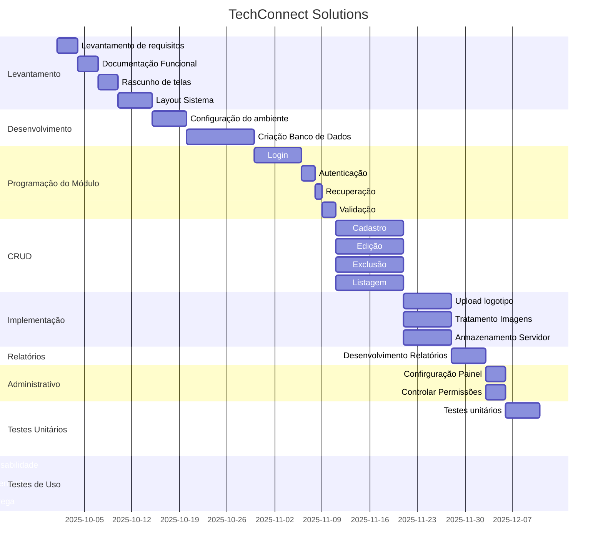
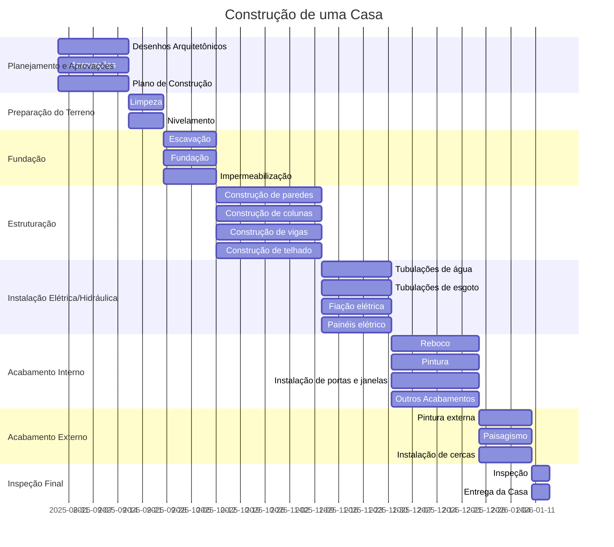
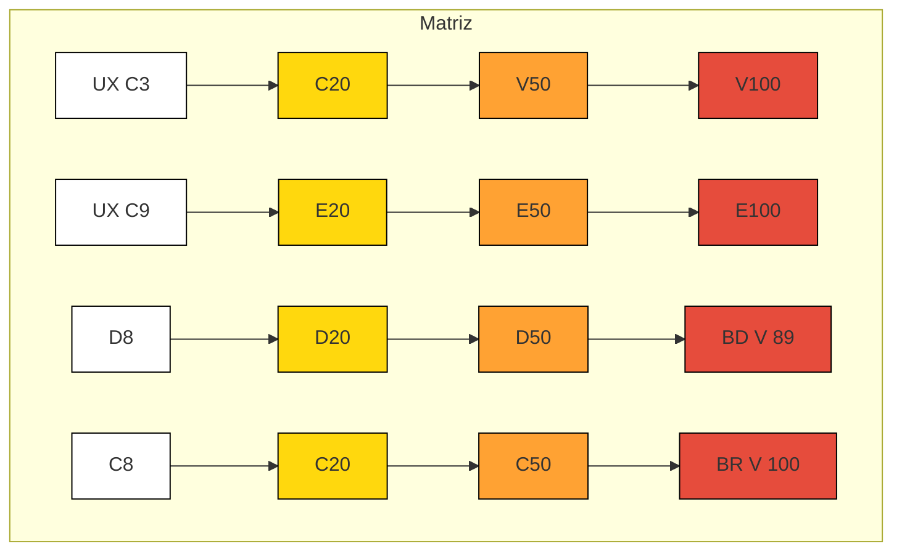

```mermaid
gantt
title TechConnect Solutions
dateFormat YYYY-MM-DD
section Levantamento
Levantamento de requisitos:lr, 2025-10-01, 3d
Documentação Funcional:df, after lr, 3d
Rascunho de telas:rt, after df, 3d
Layout Sistema:ls, after rt, 5d

section Desenvolvimento
Configuração do ambiente:ca, after ls, 5d
Criação Banco de Dados:db, after ca, 10d

section Programação do Módulo
Login:lo, after db, 7d
Autenticação:at, after lo, 2d
Recuperação:rs, after at, 1d
Validação:va, after rs, 2d

section CRUD
Cadastro:ct, after va, 10d
Edição:ed, after va, 10d
Exclusão:ex, after va, 10d
Listagem:li, after va, 10d

section Implementação
Upload logotipo:ul, after li, 7d
Tratamento Imagens:ti, after li, 7d
Armazenamento Servidor:as, after li, 7d

section Relatórios
Desenvolvimento Relatórios:dr, after as, 5d

section Administrativo
Confirguração Painel: cp, after dr, 3d
Controlar Permissões: cp, after dr, 3d

section Testes Unitários
Testes unitários:tu, after cp, 5d
Relatórios de falhas: rf, after tu, 2d
Correções:co, after rf, 5d

section Testes de Uso
Teste de usabilidade:tu, after rf, 7d
Implementação:im, after tu, 5d
Entrega: en, after im, 7d
```

```mermaid
gantt
title Construção de uma Casa
dateFormat YYYY-MM-DD
section Planejamento e Aprovações
Desenhos Arquitetônicos:pa, 2025-08-28, 20d
Aprovações:pa, 2025-08-28, 20d
Plano de Construção:pa, 2025-08-28, 20d
section Preparação do Terreno
Limpeza: pt, after pa, 10d
Nivelamento: pt, after pa, 10d
section Fundação
Escavação:ec, after pt, 15d
Fundação:ec, after pt, 15d
Impermeabilização:ec, after pt, 15d
section Estruturação
Construção de paredes:fu, after ec, 30d
Construção de colunas:fu, after ec, 30d
Construção de vigas:fu, after ec, 30d
Construção de telhado:fu, after ec, 30d
Section Instalação Elétrica/Hidráulica
Tubulações de água:eh, after fu, 20d
Tubulações de esgoto:eh, after fu, 20d
Fiação elétrica:eh, after fu, 20d
Painéis elétrico:eh, after fu, 20d
section Acabamento Interno
Reboco:ai, after eh, 25d
Pintura:ai, after eh, 25d
Instalação de portas e janelas:ai, after eh, 25d
Outros Acabamentos:ai, after eh, 25d
section Acabamento Externo
Pintura externa:ae, after ai, 15d
Paisagismo:ae, after ai, 15d
Instalação de cercas:ae, after ai, 15d
section Inspeção Final
Inspeção:if, after ae, 5d
Entrega da Casa:if, after ae, 5d

```

```mermaid
graph TD
  subgraph Matriz
A1["UX C3"]:::branco --> A2["C20"]:::amarelo --> A3["V50"]:::laranja --> A4["V100"]:::vermelho
B1["UX C9"]:::branco --> B2["E20"]:::amarelo --> B3["E50"]:::laranja --> B4["E100"]:::vermelho
C1["D8"]:::branco --> C2["D20"]:::amarelo --> C3["D50"]:::laranja --> C4["BD V 89"]:::vermelho
D1["C8"]:::branco --> D2["C20"]:::amarelo --> D3["C50"]:::laranja --> D4["BR V 100"]:::vermelho

  end
classDef branco fill:#fff, stroke:#000, stroke-width:1px;
classDef amarelo fill:#FFD80D, stroke:#000, stroke-width:1px;
classDef laranja fill:#FFA233, stroke:#000, stroke-width:1px;
classDef vermelho fill:#E64C3C, stroke:#000, stroke-width:1px;
```
