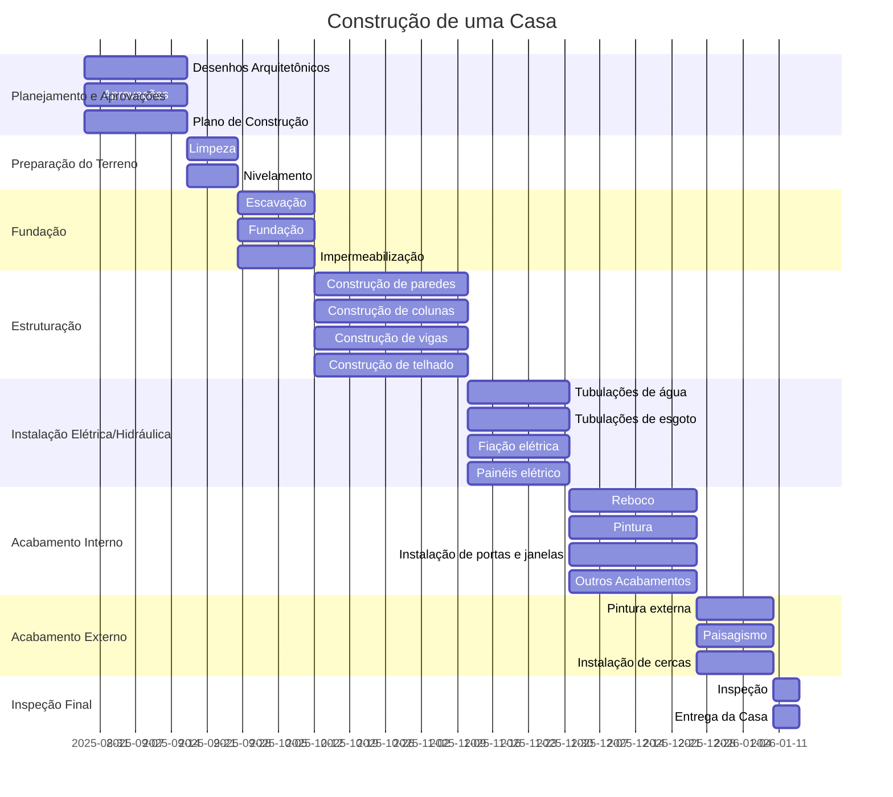
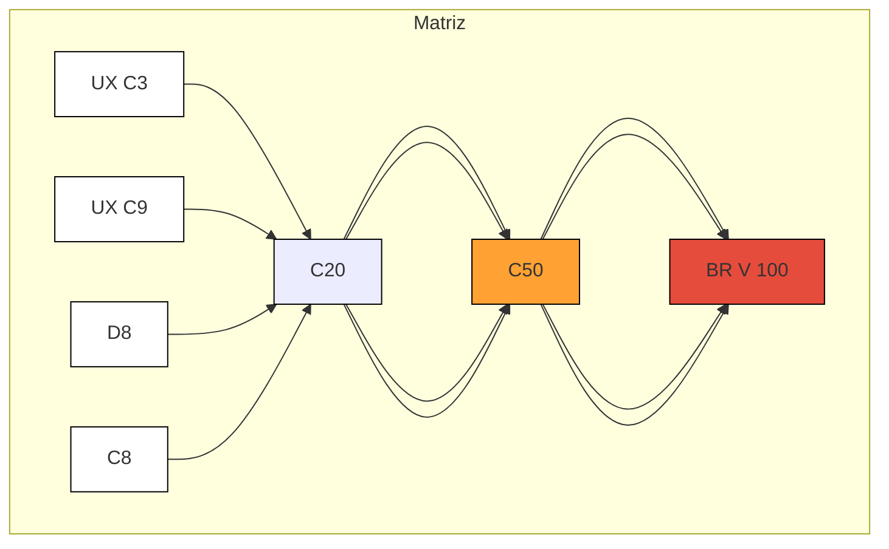

```mermaid
gantt
title Construção de uma Casa
dateFormat YYYY-MM-DD
section Planejamento e Aprovações
Desenhos Arquitetônicos:pa, 2025-08-28, 20d
Aprovações:pa, 2025-08-28, 20d
Plano de Construção:pa, 2025-08-28, 20d
section Preparação do Terreno
Limpeza: pt, after pa, 10d
Nivelamento: pt, after pa, 10d
section Fundação
Escavação:ec, after pt, 15d
Fundação:ec, after pt, 15d
Impermeabilização:ec, after pt, 15d
section Estruturação
Construção de paredes:fu, after ec, 30d
Construção de colunas:fu, after ec, 30d
Construção de vigas:fu, after ec, 30d
Construção de telhado:fu, after ec, 30d
Section Instalação Elétrica/Hidráulica
Tubulações de água:eh, after fu, 20d
Tubulações de esgoto:eh, after fu, 20d
Fiação elétrica:eh, after fu, 20d
Painéis elétrico:eh, after fu, 20d
section Acabamento Interno
Reboco:ai, after eh, 25d
Pintura:ai, after eh, 25d
Instalação de portas e janelas:ai, after eh, 25d
Outros Acabamentos:ai, after eh, 25d
section Acabamento Externo
Pintura externa:ae, after ai, 15d
Paisagismo:ae, after ai, 15d
Instalação de cercas:ae, after ai, 15d
section Inspeção Final
Inspeção:if, after ae, 5d
Entrega da Casa:if, after ae, 5d

```

```mermaid
graph TD
  subgraph Matriz
A1["UX C3"]:::branco --> A2["C20"]:::amarelo --> A3["V50"]:::laranja --> A4["V100"]:::vermelho
B1["UX C9"]:::branco --> A2["E20"]:::amarelo --> A3["E50"]:::laranja --> A4["E100"]:::vermelho
C1["D8"]:::branco --> A2["D20"]:::amarelo --> A3["D50"]:::laranja --> A4["BD V 89"]:::vermelho
D1["C8"]:::branco --> A2["C20"]:::amarelo --> A3["C50"]:::laranja --> A4["BR V 100"]:::vermelho

  end
classDef branco fill:#fff, stroke:#000, stroke-width:1px;
classDef amarelo fill:#FFD8D, stroke:#000, stroke-width:1px;
classDef laranja fill:#FFA233, stroke:#000, stroke-width:1px;
classDef vermelho fill:#E64C3C, stroke:#000, stroke-width:1px;
```
