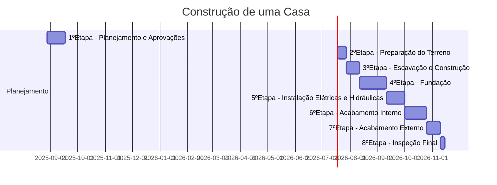

```mermaid
gantt
title Construção de uma Casa
dateFormat YYYY-MM-DD
section Planejamento
1ºEtapa - Planejamento e Aprovações:active pa, 2025-08-28, 20d
2ºEtapa - Preparação do Terreno: pt, after pa, 10d
3ºEtapa - Escavação e Construção:ec, after pt, 15d
4ºEtapa - Fundação:fu, after ec, 30d
5ºEtapa - Instalação Elétricas e Hidráulicas:eh, after fu, 20d
6ºEtapa - Acabamento Interno:ai, after eh, 25d
7ºEtapa - Acabamento Externo:ae, after ai, 15d
8ºEtapa - Inspeção Final:if, after ae, 5d

```
