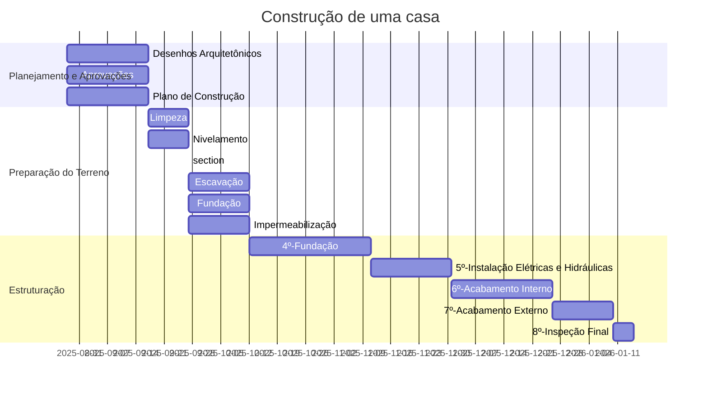

```mermaid
gantt
title Construção de uma casa
dateFormat YYYY-MM-DD
section Planejamento e Aprovações
Desenhos Arquitetônicos:pa, 2025-08-28, 20d
Aprovações:pa, 2025-08-28, 20d
Plano de Construção:pa, 2025-08-28, 20d
section Preparação do Terreno
Limpeza: pt, after pa, 10d
Nivelamento: pt, after pa, 10d
section: Fundação da Casa
Escavação:ec, after pt, 15d
Fundação:ec, after pt, 15d
Impermeabilização:ec, after pt, 15d
section Estruturação
4º-Fundação:fu, after ec, 30d
5º-Instalação Elétricas e Hidráulicas:eh, after fu, 20d
6º-Acabamento Interno:ai, after eh, 25d
7º-Acabamento Externo:ae, after ai, 15d
8º-Inspeção Final:if, after ae, 5d

```
