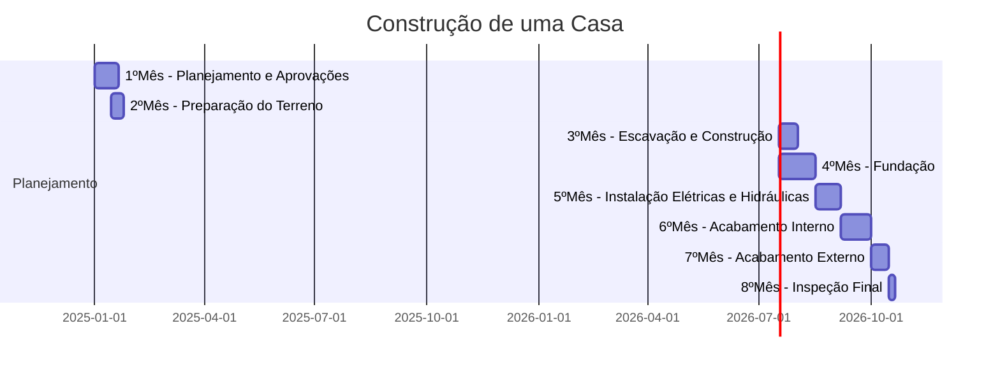

```mermaid
gantt
title Construção de uma Casa
dateFormat YYYY-MM-DD
section Planejamento
1ºMês - Planejamento e Aprovações:active pa, 2025-01-01, 20d
2ºMês - Preparação do Terreno: pt, 2025-01-15, 10d
3ºMês - Escavação e Construção:active a3, after a2, 15d
4ºMês - Fundação: a4, after a3, 30d
5ºMês - Instalação Elétricas e Hidráulicas:a5, after a4, 20d
6ºMês - Acabamento Interno:a6, after a5, 25d
7ºMês - Acabamento Externo:a7, after a6, 15d
8ºMês - Inspeção Final:a8, after a7, 5d

```
